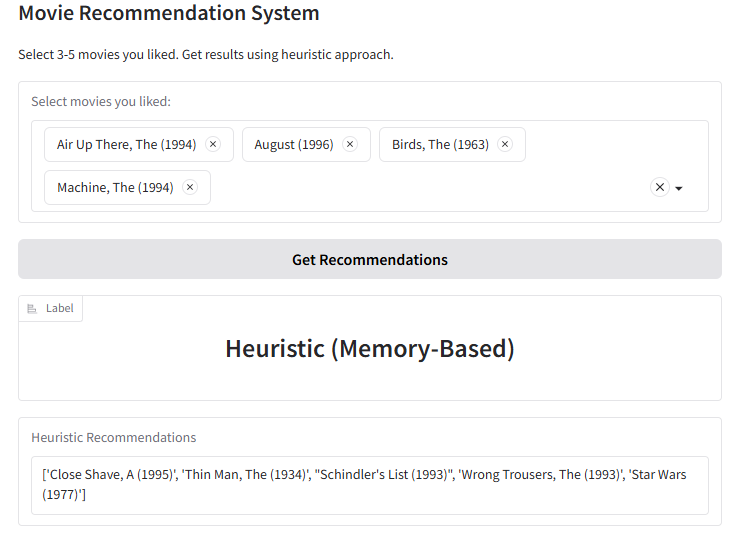

## Heuristic Recommender
This project demonstrates a simple **memory-based (heuristic)** movie recommender built with **FastAI** and **Gradio**. Users select a small set of movies they already like (3-5 titles), and the system identifies others users with similar tastes to generate personlized suggestions.

This project is for educational purpose, showing how a basic collaborative filtering heuristic can be implemented quickly. The project also includes evaluation logic to compute **Precision@K**, giving insights into the quality of recommendations.

---

  

## Project Highlights
- **FastAI integration** - quick access to Movie lens dataset through `URLs.ML_100k`.
- **Simple heuristic algorithm** - ranks unseen movies by average ratings from "similar" users.
- **Evaluation** - includes **Precision@K** metric for measuring recommendation accuracy.
- **Interactive UI** - built with **Gradio**, deployable as a Hugging Face Space or run locally.
- **Educational focus** - clean, minimal code illustrating core recommender principles.

---

## Project Structure

| File / Folder    | Description                                                                 |
|------------------|------------------------------------------------------------------------------|
| `.gitignore`     | Specifies files and directories to be ignored by Git.                       |
| `README.md`      | Project documentation (this file).                                          |
| `app.py`         | Core heuristic recommendation logic and Gradio app UI.                      |
| `evaluate.py`    | Offline evaluation utilities, including `Precision@K` computation.          |
| `requirements.txt` | Python dependencies needed to run the app and evaluation scripts.        |

## Dataset Attribution
- **Source:** [MovieLens 100k dataset](https://grouplens.org/datasets/movielens/100k/)
- Contains 100,000 ratings from 943 users on 1,682 movies.
- Includes user IDs, movie IDs/titles, and explicit ratings (1-5 scale).
- Loaded automatically via FastAI (`URLs.ML_100k`) for reproducibility.

> Dataset Citation:
> *F. Maxwell Harper and Joseph A. Konstan. 2015. The MovieLens Datasets: History and Context. ACM Transactions on Interactive Intelligent Systems (TiiS) 5, 4, Article 19*

